# TankStorm · 坦克风云经典归来

一个面向 **Windows x64** 的原生单机策略游戏项目，重现早期基地建设、四兵种生产和六格编队的游玩体验。当前版本为 **0.23.0**，使用 Godot 4.6.2 绘制界面与战斗，通过本地 TypeScript 规则进程完成确定性结算和存档。

本项目是个人怀旧重制，非官方客户端。图片、图标和音效使用项目自制素材；部分经典玩法参考公开资料，未核实的原版数值和细节明确标记为单机适配。

**直接游玩：** 前往 [v0.23.0 Release](https://github.com/bei-li16/TankStorm/releases/tag/v0.23.0)，下载 `TankStorm-v0.23.0-portable.zip`，完整解压后运行 `TankStorm.exe`。游戏无需安装 Godot 或 Node.js；请保留包内所有文件。GitHub 自动生成的 Source code 包用于开发，不是可直接运行的游戏。

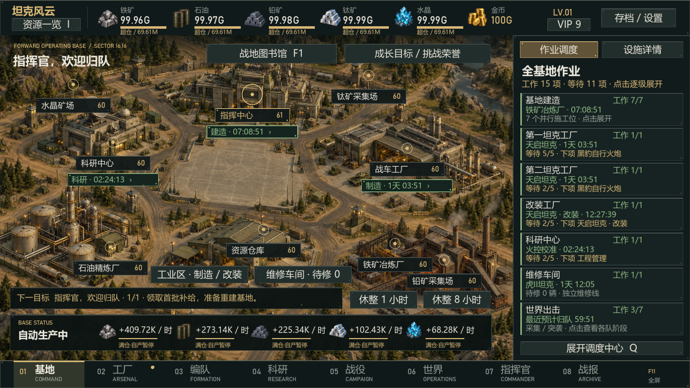

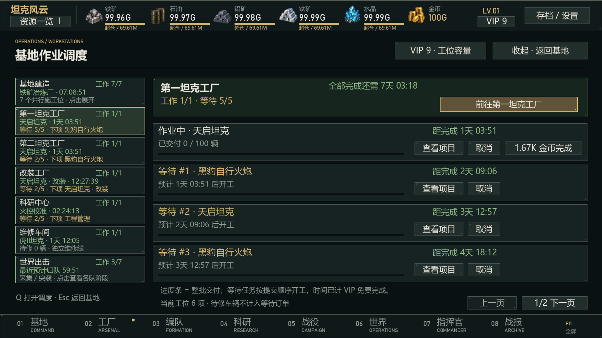

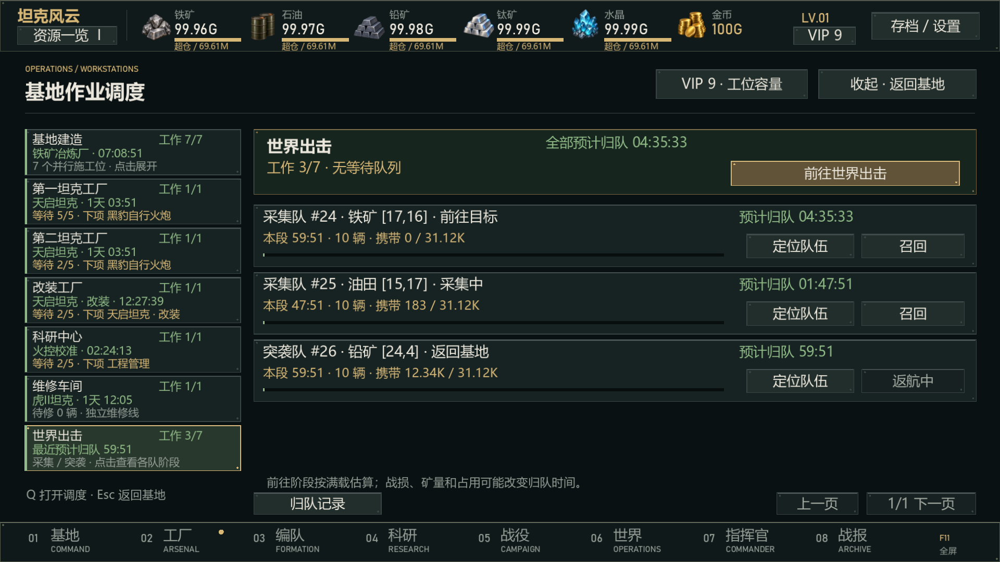

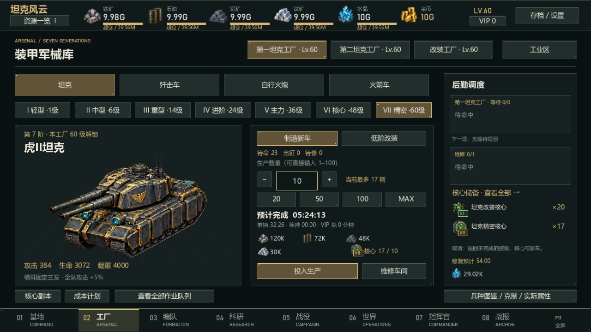

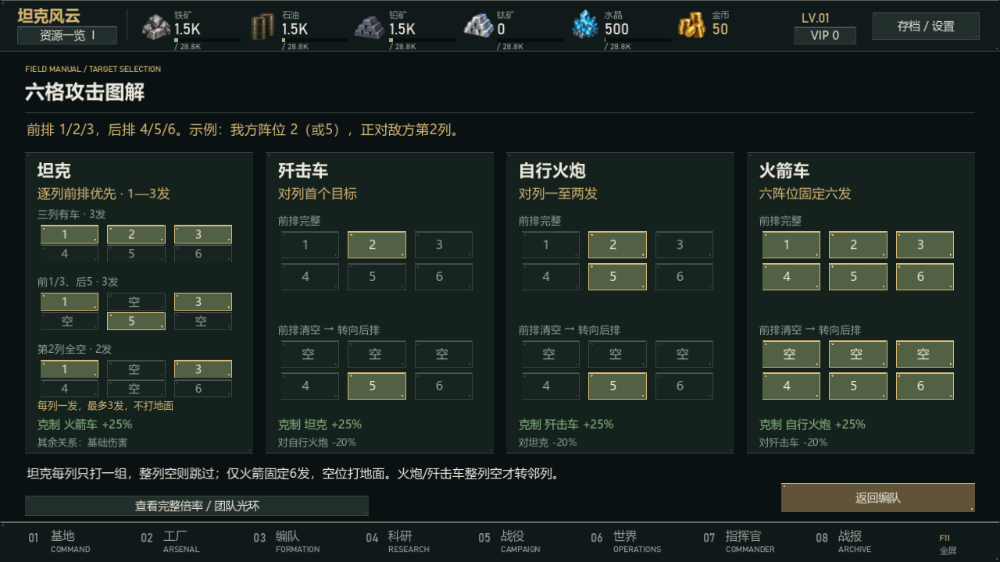

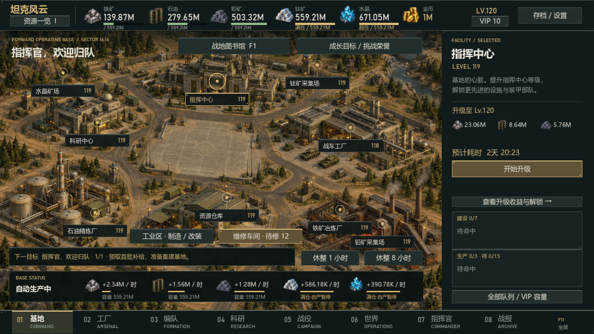

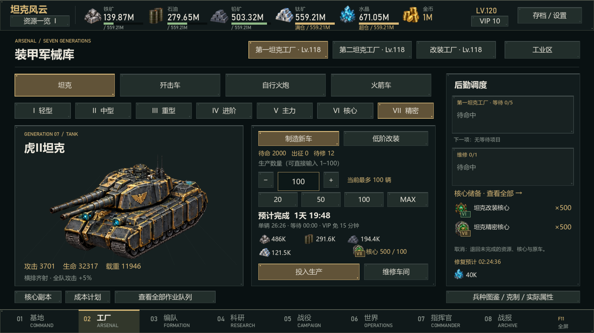

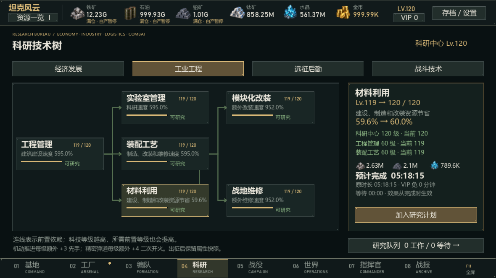

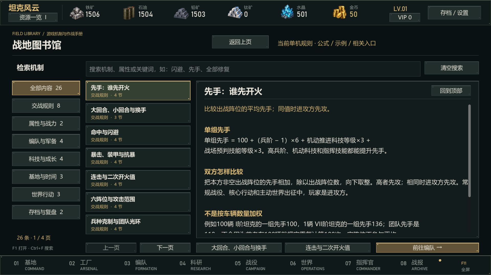

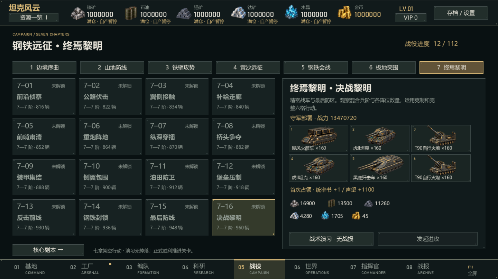

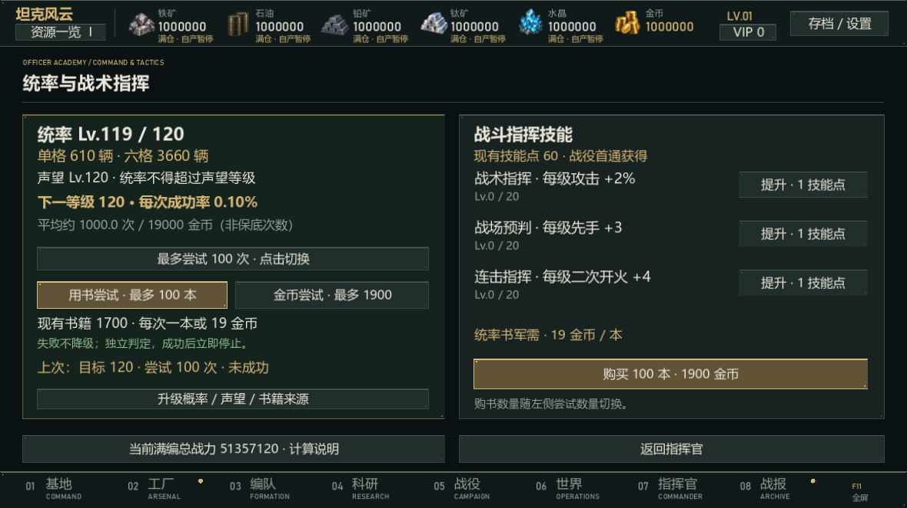

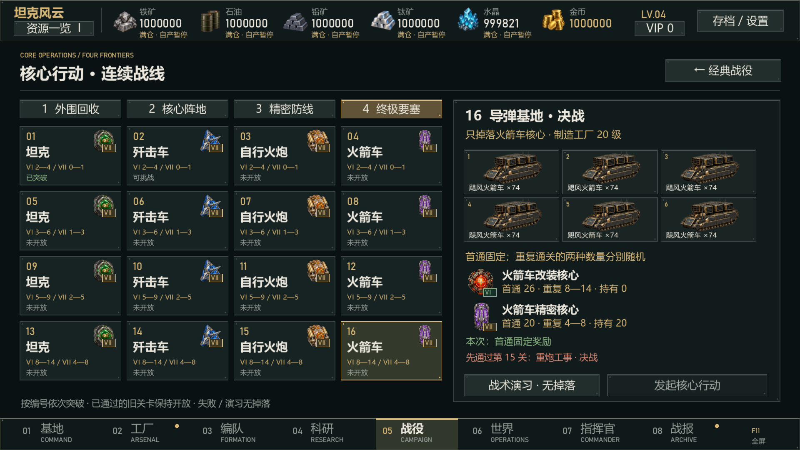

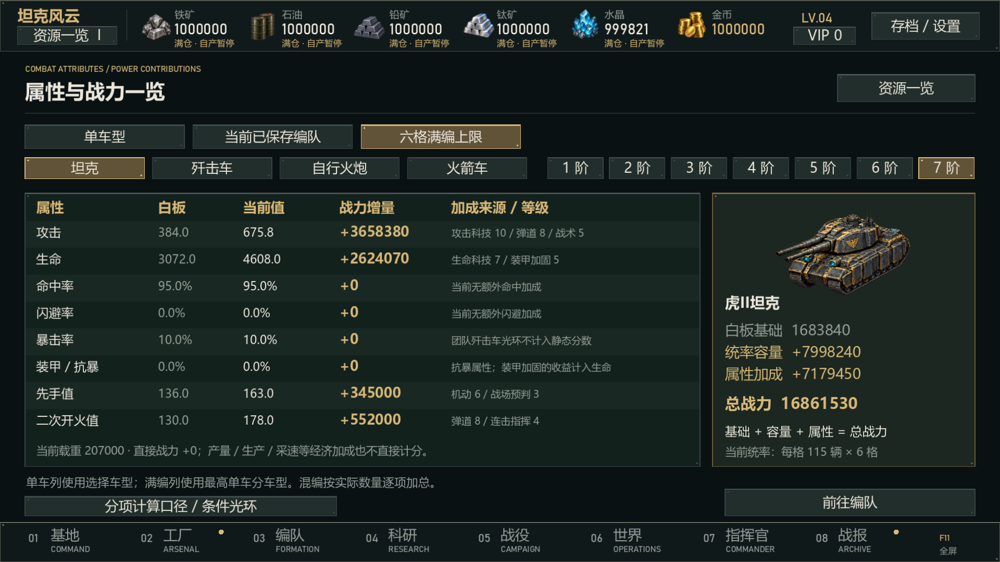

此前实机截图：[维修数量](docs/images/repair-v013.png)、[战地档案](docs/images/reports-v013.png)、[成长与荣誉](docs/images/objectives-v013.png)、[休整预览](docs/images/rest-preview-v013.png)。

## 已实现功能

- **v0.23 基地作业调度**：基地右侧常驻七类工位，分别展示建造、两座制造厂、改装、科研、维修和世界出击的工作状态、剩余时间、等待数量及下一项。点击展开逐工位的任务清单，查看整批交付进度、等待开工和完成倒计时，支持取消、加速及直达项目。世界出击显示各队阶段、坐标、兵力、物资、归队时间，支持定位和召回。地图上的指挥中心、工厂和科研建筑也有作业标签；点击建筑仍可查看升级详情，详情只展示本设施的建设任务。按 Q 打开调度，Esc 返回，Tab/Enter 导航。队列、扣费和工期规则保持不变。

- **v0.21 工业解锁**：四系I—VII阶门槛为 **1 / 6 / 14 / 24 / 36 / 48 / 60级**。两座制造厂各看本厂等级；改装厂与任一制造厂须同时满足目标阶门槛。核心主线门槛36 / 48 / 54 / 60级，旧已通关保留重打。已有车辆和已付订单保留，新订单使用新门槛。

- **v0.22 四系射击**：坦克每列优先前排，前排空则打同列后排，整列空则跳过，共1—3发。只有火箭固定六阵位六发；空位着弹形成随地面后移的弹坑，不计伤害、闪避或击毁。火炮优先正对列存活目标，每人一发；歼击车打该列首个存活目标。整列为空才找最近邻列，同距先较小列号。图解和图书馆同步。
- **维修水晶重算**：按制造材料的基础产出价值折算水晶后取40%，再计材料科技减免；最高阶坦克基础2902、满材料科技1161水晶/辆。普通维修、全部修复、MAX和预览共享报价；已付旧订单不补扣。
- **v0.19 全等级曲线**：重做完整1—120级的产量、仓储、科研收益、建设/科研成本与时间。101—120级升级实际工期控制在12小时—5天范围内，已计科技与VIP；不同设施和科研项目有不同工期。材料节省每级0.5%，最高60%。
- **跨天军备与批量上限**：新制造/改装每批最多100辆，MAX同时考虑材料、核心、原车及批次限制。最高阶100辆约40—63小时，按车型、工厂、科技和VIP变化；保留固定工序与可加速工序。旧档已付款的1000辆等大订单仍按原快照完成。
- **仓储容量条**：顶部五矿产显示存量/容量、满仓/超仓状态；悬停显示精确值与比例。新仓储支持跨天成长，已获得的超仓物资保留。
- **分级世界与运力**：五类矿产和敌军据点覆盖1—120级，驻军兵阶、数量、科技随固定区域增强；采速由矿点等级决定。新资源点应用本版曲线，已在途的旧目标延迟迁移。v0.21按新解锁兵阶参考编队抽样计入维修、补造材料与往返后，净收益约为同期自产4.1—7.9倍，实际受战损与兵力影响。
- **120级成长**：建筑、两座制造工厂、改装厂、全部科研、指挥官经验与三项技能上限120。各厂效率从1级0%连续提升至120级100%；指挥中心21级起每日补给额外1技能点。
- **大额资源简写**：资源栏、成本、产量、仓储、采集、奖励等使用K/M/G/T；截取两位小数避免夸大余额，悬停或详情可查看完整整数。输入、扣费与存档维持精确值。
- **战地图书馆**：七类26篇机制，分类、关键词搜索、公式与算例、关联条目及功能入口。基地/设置或 F1 打开；独立文章阅读位置，战斗中打开暂停，返回继续。

- **全部修复**：维修与结算页显示总材料并确认，立即修复所有待修及已付费订单剩余车辆；库存、队列与历史结算分开处理。
- **属性一览**：单车、当前编队和满编上限三种口径，逐项显示实际属性、来源和战力增量，总分严格相符。
- **核心主线**：四段共16关逐级开放，每关掉落同车系两种核心；首通固定、重复数量随机，范围与门槛在详情明示。保留旧库存和通关。
- **资源一览**：46 项资源，分类/车系/零库存筛选，区分可用、已投入订单、在途和战车各状态。
- **战后结算**：双方有效伤害与承伤、逐阵位损耗、可修复与永久战损、物资和成长奖励；根据本场记录给出调整建议，核心奖励直接显示图标。
- **状态与历史**：生产、改装、维修和归队共享同一库存快照；远征保留实际归队凭据，原始战报和当前运输状态分别展示，旧档缺少凭据时明确标注。
- **基地与经济**：建筑升级、资源产出、仓储、科研、生产、改装及维修，开始前显示计入 VIP 免费时长的预计耗时。
- **树状科研**：经济、工业、后勤、战斗四分支，共 21 项科技；前置等级、科研中心门槛与实际加成。
- **资源重平衡**：重算五资源产出、仓储、采矿和运力；覆盖 28 种战车的整批筹料预算。
- **VIP 自动完成**：建设、科研、整批制造/改装/维修及采集进入免费时长即自动完成；往返行军照常计时。
- **四兵种七阶**：坦克、歼击车、自行火炮、火箭车，共 28 种战车；高阶制造和改装消耗副本核心。
- **战前编队**：战役、副本和世界出征前换车、调整数量与阵位、预览已知敌军；卡片显示实际属性与克制，支持库存筛选、替换对比和六格攻击图解。取消不出战；战后“再次挑战”直接用当前可用编队开战。
- **六格战斗**：横排、单体、纵列、全体攻击与兵种克制；斜向等距战场、中央视野折叠、炮口弹道、击毁动画及随地面后移的残骸。
- **大小回合与连发**：每个大回合双方各存活阵位行动一次；小回合交替开火，少阵位一方等待。连击归属当前小回合，坦克横排逐发、火炮纵列逐发。克制界面明示 +25% 与部分弱势关系 −20%。
- **战力与排布**：同阶四车系白板单车等分，实际分数计入战斗科技和指挥官技能；区分当前编队、库存最大可编和当前成长六格满编上限，支持最大战力与最高兵阶排布。
- **统率培养**：上限120且不超过声望等级，书籍19金币一本；用书或金币逐次独立升级，10级后概率下降至0.1%，无保底。批量成功即停，实际次数扣费；战役和核心本可重复产书。
- **战斗回放**：暂停、1/2/4 倍速、逐次完整攻击、跳过和重播；读取原始快照，不重复结算。战场有阵位、生命、行动者与目标标记，四车系分别具有发射与命中音效。
- **野战指挥台 UI**：统一墨绿、枪灰与黄铜主题；独立弹窗阅读位置、Tab/Enter 导航、音量和 100%/110%/120% 正文缩放。工业、油田、要塞、试验场使用不同地表，八种核心恢复早期发光机械风格，并标注 VI/VII 阶。
- **维修与作业反馈**：维修进入、切换与库存变化时重新校验数量；整批队列进度、满仓提示、休整前预计与结束后实际汇总。
- **战地档案与预设**：日期、类型、损失和核心奖励，类型/胜负筛选，新记录手动刷新以保持点击位置；预设支持加载、重命名、确认覆盖与删除。
- **后期目标**：真实进度驱动的成长计划、四兵种限定精英挑战与低战损荣誉；高阶成本计划计算材料、核心缺额、预计胜场、原车和时间。核心掉落升级为分段随机区间，战斗属性公式不变。
- **世界与休整**：地图按资源、等级、情报筛选；区分下一队计划和已出征队伍，展示采集量、运力、速度、分段时间及实际入库记录；休整后汇总资源与完成项目。
- **单人内容**：7 章 ×16 关经典战役、16 关连续核心主线、世界侦察与采集、战损修复、指挥官成长和任务奖励。
- **本地存档**：自动保存、新建、切换、复制、重命名、备份恢复、JSON 导入导出与离线进度结算。
- **单机便利功能**：休整推进时间、VIP 福利与队列扩展、本机 root 模拟充值入口。没有真实支付。

游戏面向离线单人体验，没有真人联机、在线账号或军团系统。发布客户端不使用 HTML、WebView 或 Electron；历史网页原型源码仍保留作参考。

## 从源码运行

### 环境

| 工具     | 要求                                                                   |
| -------- | ---------------------------------------------------------------------- |
| 操作系统 | Windows x64；图形界面需支持 Godot Compatibility 渲染器                 |
| Node.js  | **24.x x64**，原生桥接构建目标为 Node 24，构建时会复制当前 Node 运行时 |
| npm      | 使用 Node.js 随附版本，依赖由 `package-lock.json` 锁定                 |
| Python   | 3.10 或更新版本，用于下载固定版本的 Godot 工具链                       |
| Godot    | 4.6.2 stable Windows x64，按下面的脚本准备                             |

首次安装 npm 依赖和下载 Godot 时需要网络。完成准备后，游戏在本机运行，不依赖互联网服务。

```powershell
git clone https://github.com/bei-li16/TankStorm.git
cd TankStorm
npm ci
python native/bootstrap-godot.py
npm run dev
```

`bootstrap-godot.py` 从 Godot 官方发布下载固定版本编辑器和 Windows 导出模板，保存到忽略目录 `.tools/`。脚本校验编辑器的官方 SHA-512，并由 ZIP 读取器校验解压文件 CRC。

`npm run dev` 会构建本地规则进程、准备开发运行时、导入素材并启动 Godot 窗口。游戏入口为 [native/project.godot](native/project.godot)。

### 构建 Windows 便携版

```powershell
npm run build:native
npm start
```

构建输出位于 `release/TankStorm-v<package.json 中的版本>/`。运行其中的 `TankStorm.exe` 即可游玩，也可使用构建生成的 `start-game.cmd`。

分发时需保留整个输出目录，包括 `runtime/`、`rules/` 和 `licenses/`；不能只复制主 EXE。完整便携目录内置依赖，玩家无需安装 Godot 或 Node.js。存档保存在 Windows 用户目录，不会随构建覆盖。

**本 Git 仓库仅保存源码、文档和源素材，不提交 EXE、DLL、Node/Godot 可执行文件、PCK、ZIP 或已打包游戏。** 构建结果保留在本地忽略目录中。

## 开发与验证

```powershell
npm run check         # TypeScript 检查及源码格式检查
npm test              # 确定性规则、成长、存档、队列及原生桥接测试
npm run test:report   # JSON 结果写入 artifacts/（不提交）
node native/tests/pacing120.mjs  # 当前时长矩阵/经济台账/世界战斗抽样，输出至 artifacts/native-v19/
```

准备 Godot 后，可单独验证 GDScript 语法与炮口弹道：

```powershell
& ./.tools/godot/Godot_v4.6.2-stable_win64_console.exe --headless --path native --script res://scripts/game.gd --check-only
& ./.tools/godot/Godot_v4.6.2-stable_win64_console.exe --headless --path native --script res://tests/aim.gd
```

v0.23.0 共430项规则、存档与桥接测试通过，类型与格式检查通过。新增调度专项覆盖并行建造、工厂与科研FIFO、取消退款、即时完成、大跨度休整、旧订单重载和远征归队。Windows实机验收与截图见 [v0.23 基地作业调度](docs/40-v023-base-dispatch.txt)。此前v0.22射击回放验收保留在 [坦克选敌修正](docs/39-v022-tank-column-targeting.txt)。

调度专项使用隔离副本：

```powershell
node native/tests/dispatch23.mjs
& ./release/TankStorm-v0.23.0/TankStorm.exe --log-file "$((Resolve-Path artifacts/native-v23).Path)/godot.log" -- --smoke --dispatch-only --qa-output="$((Resolve-Path artifacts/native-v23).Path)"
```

```powershell
node native/tests/targeting22.mjs
npm run build:native
& ./release/TankStorm-v0.22.0/TankStorm.exe --log-file "$((Resolve-Path artifacts/native-v22).Path)/godot.log" -- --smoke --tank-targets-only --qa-output="$((Resolve-Path artifacts/native-v22).Path)"
```

评测使用独立存档，旧战报夹具按原事件回放，不访问玩家主存档。[v0.21工厂解锁与旧订单验收](docs/38-v021-factory-unlocks.txt)保留为历史记录，相关规则测试继续通过。

以下为v0.19历史验收记录；完整1—120曲线与兼容测试在本轮继续通过。

本轮专项32张截图、日志与统计记录保留在忽略目录 `artifacts/native-v19/`。Windows原生操作覆盖四种窗口、100%/120%文字缩放与全屏；两厂四批100辆、改装100辆、维修12辆跨96小时结算并读档，归队回放未重复奖励。评测使用独立存档，未操作玩家主存档。尚未进行多日人类完整成长追踪。

原有完整原生流程也已通过 `NATIVE_SMOKE_PASS`；416张回归截图与日志保留在 `artifacts/native-v19-regression/`。

```powershell
npx vitest run --reporter=json --outputFile=artifacts/test-results-v19.json
npm run build:native
node native/tests/pacing120.mjs
& ./release/TankStorm-v0.19.0/TankStorm.exe --log-file "$((Resolve-Path artifacts/native-v19).Path)/godot.log" -- --smoke --pacing-only --qa-output="$((Resolve-Path artifacts/native-v19).Path)"
```

`--pacing-only` 验证当前曲线、容量条、旧大订单及世界归队；原有全流程入口保留，需要对应历史场景的评测夹具。评测程序始终使用隔离的测试存档。

| 命令                                     | 用途                                       |
| ---------------------------------------- | ------------------------------------------ |
| `npm run dev`                            | 运行 Windows 原生开发版                    |
| `npm run build:native` / `npm run build` | 构建 Windows 便携目录                      |
| `npm start` / `npm run preview`          | 启动已构建版本                             |
| `npm run check`                          | 检查类型与格式                             |
| `npm test` / `npm run test:watch`        | 运行测试 / 监听测试                        |
| `npm run dev:web`                        | 运行历史网页原型，不代表当前原生客户端功能 |

## 项目结构

```text
TankStorm/
├─ native/
│  ├─ project.godot          Godot 工程
│  ├─ scripts/game.gd       原生界面、输入、战斗回放与音频调度
│  ├─ rules/bridge.ts       本地规则进程、文件存档与客户端桥接
│  ├─ assets/               图片、音效、图集坐标及素材来源清单
│  ├─ tests/aim.gd          炮口与弹道验证
│  ├─ licenses/             第三方运行时许可
│  ├─ bootstrap-godot.py    固定版本工具链下载脚本
│  └─ build.mjs             原生构建与便携目录生成
├─ src/core/                游戏规则、经济、战斗、队列与存档校验
├─ src/client/              历史网页原型的本地通信代码
├─ src/ui/                  历史网页原型界面
├─ tests/                   自动化测试
├─ design/                  机器可读规则配置
├─ docs/                    研究、需求、设计及版本说明
├─ references/              公开资料来源索引
├─ public/                  历史网页原型源素材
└─ package-lock.json        锁定的 npm 依赖
```

原生客户端只与本机规则进程通信，监听地址为 `127.0.0.1` 的随机端口，并使用会话令牌；不提供公网服务。战斗结算先保存事件，回放消费已保存事件，不重复发奖。

当前工业区为两座制造工厂加一座独立改装厂，第二工厂与改装厂在指挥中心 13 级开放建设。维修车间集中展示待修车辆；正式战损按同型号合计的 80% 向上取整进入待修。[查看维修车间截图](docs/images/repair-v08.png)。

## 存档与操作

存档目录：`%APPDATA%/TankStormClassic/saves`。右上角“存档 / 设置”支持多存档管理及导入导出。换电脑时请导出 JSON 并在新电脑导入；复制游戏目录本身不会复制存档。

- `1–8`：切换主要界面；`F11`：全屏；`Esc`：返回。
- `F5`：保存，包括正在编辑的编队；`空格`：暂停 / 恢复战斗回放。
- 世界地图：滚轮缩放、右键拖动，支持坐标定位。
- 单机 root：顶部 VIP 面板进入，初始配置及使用方法见 [玩家指南](native/PLAYER_GUIDE.txt)。本机密码配置和玩家存档均不提交 Git。

v0.17起等级上限为120，旧存档正常读取；已排队作业保留原费用和时间。超过原等级上限的存档请用当前或更新客户端打开。保留旧通关进度、8种核心库存、维修订单及统率，不追补旧首通奖励。新战斗使用 `classic-combat-v0.20`，历史战报保留原事件与结果。车辆仍为七阶，敌军内容沿用112关与16关核心主线。详见版本说明。

## 设计资料

| 文档                                                                   | 内容                                       |
| ---------------------------------------------------------------------- | ------------------------------------------ |
| [v0.22 坦克选敌](docs/39-v022-tank-column-targeting.txt) | 每列前排优先、后排补位、空列跳过、1—3次独立开火与历史回放 |
| [v0.23 基地作业调度](docs/40-v023-base-dispatch.txt) | 七工位常驻总览、逐工位展开、等待顺序、独立厂线及远征阶段 |
| [v0.21 工业解锁](docs/38-v021-factory-unlocks.txt) | 四系解锁曲线、60级VII阶、核心主线门槛、旧订单与实机验证 |
| [v0.20 武器与维修](docs/37-v020-weapons-and-repair.txt) | 固定3/6发、按列选敌、地面弹坑、水晶费用与验证 |
| [v0.19 全等级曲线与工业节奏](docs/36-v019-pacing120-and-capacity.txt) | 12小时—5天升级、100辆批次、仓储条与兼容验证 |
| [v0.18 经济与世界调整](docs/35-v018-economy-world-rebalance.txt) | 历史平衡依据与分级世界 |
| [v0.16 战地图书馆](docs/33-v016-field-library.txt) | 七类机制、搜索、公式、独立阅读与实机验收 |
| [v0.15 修复、核心与属性](docs/32-v015-repair-core-campaign-attributes.txt) | 即时维修、16关双掉落、属性贡献与验证 |
| [v0.14 大小回合与成长](docs/31-v014-rounds-power-campaign-command.txt) | 战力公式、112关、统率概率/费用、迁移与验证 |
| [研究证据与来源](docs/01-research-evidence.md)                         | 官方资料、社区记录与证据边界               |
| [产品需求](docs/03-product-requirements.md)                            | 功能范围与验收要求                         |
| [系统设计](docs/04-system-design.md)                                   | 建筑、经济、科技、行军与成长               |
| [战斗设计](docs/05-battle-design.md)                                   | 六格、攻击范围、克制与战损                 |
| [Windows 架构](docs/14-native-windows.md)                              | Godot 客户端、本地规则进程与实现边界       |
| [七阶战车与核心副本](docs/15-arsenal-and-battle-v04.md)                | 车型、解锁及改装                           |
| [VIP 与队列设计](docs/17-v06-VIP-and-fixes.txt)                        | 等级福利、队列与模拟充值                   |
| [v0.9.1 战前编队](docs/22-v091-prebattle-deployment.txt)               | 调整、敌军预览、确认出战、取消与原子结算   |
| [v0.10.0 交替回合](docs/23-v010-turns-and-sequential-fire.txt)         | 逐发射击、先手、二次开火和历史战报兼容     |
| [v0.11.0 后勤与结算](docs/24-v011-depot-and-settlement.txt)            | 直接升级、资源总览、战后明细、八种核心图标 |
| [v0.9 经济与科研](docs/20-v09-economy-research.txt)                    | 资源曲线、免费完成、科技树及兼容规则       |
| [完整数值审计](docs/21-v09-economy-audit.txt)                          | 28 车型筹料/制造/维修、仓储与建设预算      |
| [v0.8 维修与工业区](docs/19-v08-recovery-and-industry.txt)             | 80% 战损、维修车间、两制造一改装与旧档兼容 |
| [v0.7 战斗更新](docs/18-v07-combat-and-presentation.txt)               | 经典攻击核对、残骸、声音与外形             |
| [原版待核实规则](docs/11-open-questions.md)                            | 已知差异和仍待验证的细节                   |
| [规则配置](design/classic-prototype-rules.json)                        | 当前单机参数                               |

部分历史文档指向本地 `artifacts/` 或 `release/` 文件；这些目录有意不入库。仓库内的说明和源素材可直接查阅，运行与构建以本 README 为准。

## 素材与许可

图片使用内置 imagegen 生成，图集和炮口元数据在仓库内；四车系音效由 [native/generate_audio.py](native/generate_audio.py) 确定性合成。普通构建直接使用已提交的 PNG/WAV，不需要图像生成服务或 API 密钥。重新生成音效时另需 Python 的 NumPy。

- [美术来源与提示词](native/assets/manifest.json)
- [音效说明与散列](native/assets/audio/manifest.json)
- [MIT License](LICENSE)：沿用本仓库原有许可证。
- [Godot 许可](native/licenses/Godot.txt)、[Node.js 许可](native/licenses/Node.txt)：随本地便携构建保留。

公开参考资料、原游戏名称及其商标仍归各自权利人所有。
