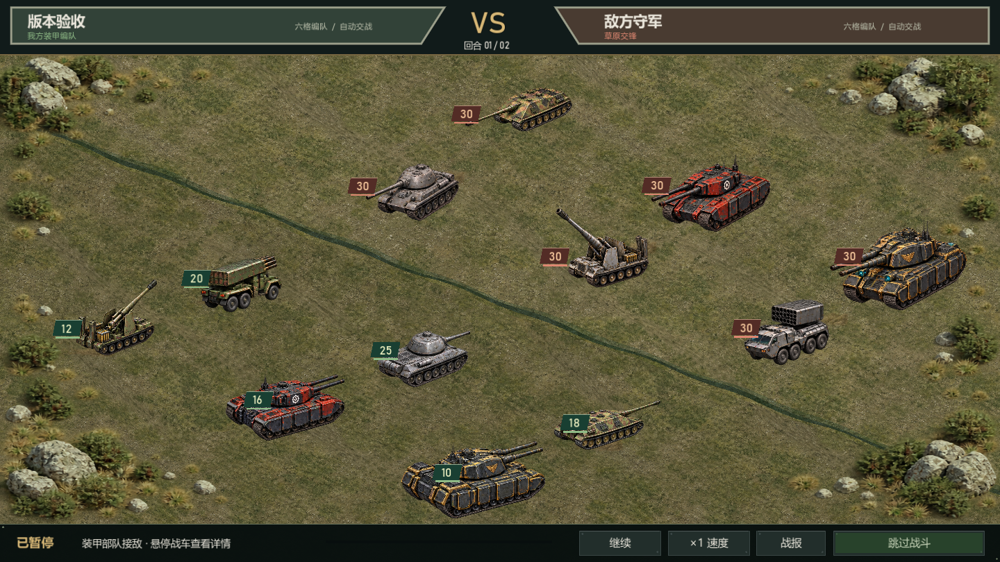

# TankStorm · 坦克风云经典归来

一个面向 **Windows x64** 的原生单机策略游戏项目，重现早期基地建设、四兵种生产和六格编队的游玩体验。当前版本为 **0.7.0**，使用 Godot 4.6.2 绘制界面与战斗，通过本地 TypeScript 规则进程完成确定性结算和存档。

本项目是个人怀旧重制，非官方客户端。图片、图标和音效使用项目自制素材；部分经典玩法参考公开资料，未核实的原版数值和细节明确标记为单机适配。



## 已实现功能

- **基地与经济**：建筑升级、资源产出、仓储、科研、生产、改装及维修，开始前显示预计耗时。
- **四兵种七阶**：坦克、歼击车、自行火炮、火箭车，共 28 种战车；高阶制造和改装消耗副本核心。
- **六格战斗**：横排、单体、纵列、全体攻击与兵种克制；斜向等距战场、中央视野折叠、炮口弹道、击毁动画及随地面后移的残骸。
- **战斗回放**：暂停、1/2/4 倍速、跳过和重播；四车系分别具有发射与命中音效。
- **单人内容**：12 个战役、8 个核心副本、世界侦察与采集、战损修复、指挥官成长和任务奖励。
- **本地存档**：自动保存、新建、切换、复制、重命名、备份恢复、JSON 导入导出与离线进度结算。
- **单机便利功能**：休整推进时间、VIP 福利与队列扩展、本机 root 模拟充值入口。没有真实支付。

游戏面向离线单人体验，没有真人联机、在线账号或军团系统。发布客户端不使用 HTML、WebView 或 Electron；历史网页原型源码仍保留作参考。

## 从源码运行

### 环境

| 工具 | 要求 |
| --- | --- |
| 操作系统 | Windows x64；图形界面需支持 Godot Compatibility 渲染器 |
| Node.js | **24.x x64**，原生桥接构建目标为 Node 24，构建时会复制当前 Node 运行时 |
| npm | 使用 Node.js 随附版本，依赖由 `package-lock.json` 锁定 |
| Python | 3.10 或更新版本，用于下载固定版本的 Godot 工具链 |
| Godot | 4.6.2 stable Windows x64，按下面的脚本准备 |

首次安装 npm 依赖和下载 Godot 时需要网络。完成准备后，游戏在本机运行，不依赖互联网服务。

```powershell
git clone https://github.com/bei-li16/TankStorm.git
cd TankStorm
npm ci
python native/bootstrap-godot.py
npm run dev
```

`bootstrap-godot.py` 从 Godot 官方发布下载固定版本编辑器和 Windows 导出模板，保存到忽略目录 `.tools/`。脚本校验编辑器的官方 SHA-512，并由 ZIP 读取器校验解压文件 CRC。

`npm run dev` 会构建本地规则进程、准备开发运行时、导入素材并启动 Godot 窗口。游戏入口为 [native/project.godot](native/project.godot)。

### 构建 Windows 便携版

```powershell
npm run build:native
npm start
```

构建输出位于 `release/TankStorm-v<package.json 中的版本>/`。运行其中的 `TankStorm.exe` 即可游玩，也可使用构建生成的 `start-game.cmd`。

分发时需保留整个输出目录，包括 `runtime/`、`rules/` 和 `licenses/`；不能只复制主 EXE。完整便携目录内置依赖，玩家无需安装 Godot 或 Node.js。存档保存在 Windows 用户目录，不会随构建覆盖。

**本 Git 仓库仅保存源码、文档和源素材，不提交 EXE、DLL、Node/Godot 可执行文件、PCK、ZIP 或已打包游戏。** 构建结果保留在本地忽略目录中。

## 开发与验证

```powershell
npm run check         # TypeScript 检查及源码格式检查
npm test              # 确定性规则、成长、存档、队列及原生桥接测试
npm run test:report   # JSON 结果写入 artifacts/（不提交）
```

准备 Godot 后，可单独验证 GDScript 语法与炮口弹道：

```powershell
& ./.tools/godot/Godot_v4.6.2-stable_win64_console.exe --headless --path native --script res://scripts/game.gd --check-only
& ./.tools/godot/Godot_v4.6.2-stable_win64_console.exe --headless --path native --script res://tests/aim.gd
```

v0.7 本地验收记录为 148 项自动测试、2,016 组弹道方向检查，以及 Windows 原生存档、生产、关卡解锁、VIP 和回放流程检查。截图、日志和测试报告属于本地输出，不作为运行所需文件提交。

| 命令 | 用途 |
| --- | --- |
| `npm run dev` | 运行 Windows 原生开发版 |
| `npm run build:native` / `npm run build` | 构建 Windows 便携目录 |
| `npm start` / `npm run preview` | 启动已构建版本 |
| `npm run check` | 检查类型与格式 |
| `npm test` / `npm run test:watch` | 运行测试 / 监听测试 |
| `npm run dev:web` | 运行历史网页原型，不代表当前原生客户端功能 |

## 项目结构

```text
TankStorm/
├─ native/
│  ├─ project.godot          Godot 工程
│  ├─ scripts/game.gd       原生界面、输入、战斗回放与音频调度
│  ├─ rules/bridge.ts       本地规则进程、文件存档与客户端桥接
│  ├─ assets/               图片、音效、图集坐标及素材来源清单
│  ├─ tests/aim.gd          炮口与弹道验证
│  ├─ licenses/             第三方运行时许可
│  ├─ bootstrap-godot.py    固定版本工具链下载脚本
│  └─ build.mjs             原生构建与便携目录生成
├─ src/core/                游戏规则、经济、战斗、队列与存档校验
├─ src/client/              历史网页原型的本地通信代码
├─ src/ui/                  历史网页原型界面
├─ tests/                   自动化测试
├─ design/                  机器可读规则配置
├─ docs/                    研究、需求、设计及版本说明
├─ references/              公开资料来源索引
├─ public/                  历史网页原型源素材
└─ package-lock.json        锁定的 npm 依赖
```

原生客户端只与本机规则进程通信，监听地址为 `127.0.0.1` 的随机端口，并使用会话令牌；不提供公网服务。战斗结算先保存事件，回放消费已保存事件，不重复发奖。

## 存档与操作

存档目录：`%APPDATA%/TankStormClassic/saves`。右上角“存档 / 设置”支持多存档管理及导入导出。换电脑时请导出 JSON 并在新电脑导入；复制游戏目录本身不会复制存档。

- `1–8`：切换主要界面；`F11`：全屏；`Esc`：返回。
- `F5`：保存，包括正在编辑的编队；`空格`：暂停 / 恢复战斗回放。
- 世界地图：滚轮缩放、右键拖动，支持坐标定位。
- 单机 root：顶部 VIP 面板进入，初始配置及使用方法见 [玩家指南](native/PLAYER_GUIDE.txt)。本机密码配置和玩家存档均不提交 Git。

v0.7 兼容已有存档；新战斗标记为 `classic-combat-v0.7`，历史战报保留原事件与结果。详细兼容边界见版本说明。

## 设计资料

| 文档 | 内容 |
| --- | --- |
| [研究证据与来源](docs/01-research-evidence.md) | 官方资料、社区记录与证据边界 |
| [产品需求](docs/03-product-requirements.md) | 功能范围与验收要求 |
| [系统设计](docs/04-system-design.md) | 建筑、经济、科技、行军与成长 |
| [战斗设计](docs/05-battle-design.md) | 六格、攻击范围、克制与战损 |
| [Windows 架构](docs/14-native-windows.md) | Godot 客户端、本地规则进程与实现边界 |
| [七阶战车与核心副本](docs/15-arsenal-and-battle-v04.md) | 车型、解锁及改装 |
| [VIP 与队列设计](docs/17-v06-VIP-and-fixes.txt) | 等级福利、队列与模拟充值 |
| [v0.7 战斗更新](docs/18-v07-combat-and-presentation.txt) | 经典攻击核对、残骸、声音与外形 |
| [原版待核实规则](docs/11-open-questions.md) | 已知差异和仍待验证的细节 |
| [规则配置](design/classic-prototype-rules.json) | 当前单机参数 |

部分历史文档指向本地 `artifacts/` 或 `release/` 文件；这些目录有意不入库。仓库内的说明和源素材可直接查阅，运行与构建以本 README 为准。

## 素材与许可

图片使用内置 imagegen 生成，图集和炮口元数据在仓库内；四车系音效由 [native/generate_audio.py](native/generate_audio.py) 确定性合成。普通构建直接使用已提交的 PNG/WAV，不需要图像生成服务或 API 密钥。重新生成音效时另需 Python 的 NumPy。

- [美术来源与提示词](native/assets/manifest.json)
- [音效说明与散列](native/assets/audio/manifest.json)
- [MIT License](LICENSE)：沿用本仓库原有许可证。
- [Godot 许可](native/licenses/Godot.txt)、[Node.js 许可](native/licenses/Node.txt)：随本地便携构建保留。

公开参考资料、原游戏名称及其商标仍归各自权利人所有。
