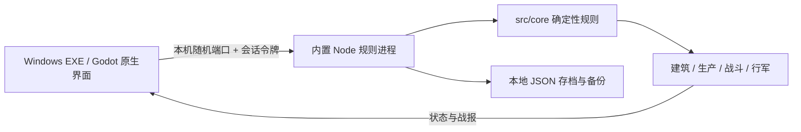

# Windows 原生版实现与验收

v0.7 在 v0.6 基础上新增残骸地面同步、四类独立音效和清晰车系外观；经典攻击范围已按官网更新。详见 [v0.7 说明](18-v07-combat-and-presentation.txt)及 [专项验收](../artifacts/native-v07/v07-regression.json)。

v0.6 验收：140 项规则测试通过；原生完整流程验证正式第一关胜利后第二关可选可战、
root 密码与模拟充值、建筑并行及生产/科研等待队列、击毁动画与暂停，炮口弹道
2016 组检查通过。原生测试使用独立 smoke 存档目录。完整等级表与适配边界见
[17 号说明](17-v06-VIP-and-fixes.txt)，实际记录见
[原生验收](../artifacts/native-v06/smoke.json)与
[v0.6 专项验收](../artifacts/native-v06/v06-acceptance.json)。

更新时间：2026-10-02。版本：0.7.0。详见 [v0.6 VIP 与修复说明](17-v06-VIP-and-fixes.txt)。用户指定的平台为 Windows，并明确只考虑单人单机体验；后续开发以本文件为准，12、13 号文档记录的是历史网页原型。

## 交付与启动

双击 `release/TankStorm-v0.7.0/TankStorm.exe` 或仓库根目录 `start-game.cmd`。游戏目录内置 `runtime/node.exe` 和 `rules/bridge.cjs`，无需另装运行环境。发布包必须整体复制，不能只复制主 EXE。v0.3.1 起按版本号生成独立发布目录，构建成功后才更新启动脚本，避免覆盖正在运行的旧版。编辑器开发输出使用 `release/development`。

- Godot 4.6.2 官方 Windows x64 release 模板导出，资源嵌入 EXE。
- 独立原生窗口、Godot Control 绘制、Texture2D 贴图、原生输入和音频。
- 无浏览器、HTML、WebView、Electron 或网页服务入口。
- 存档容器沿用 `classic-prototype-v0.1`，新战斗使用 `classic-combat-v0.7`，未增加联网 PvP、军团、账号或支付。
- Windows 系统字体运行时读取，不重新分发字体文件。

[Godot 4.6.2 官方发布页](https://godotengine.org/download/archive/4.6.2-stable/)与[命令行导出说明](https://docs.godotengine.org/en/stable/tutorials/editor/command_line_tutorial.html)是本次工具链依据。

## 实现边界

保留同一个 TypeScript 规则核心，避免重写规则造成战损、计时和资源结算差异。Node 仅负责计算和文件存档，发布包不含 React、Vite 或浏览器运行环境。通信只绑定 127.0.0.1 的系统分配端口；请求携带随机会话令牌；带浏览器 Origin 的请求被拒绝。父进程关闭后，规则进程保存并退出。

| 文件 | 职责 |
| --- | --- |
| `native/project.godot`、`native/main.tscn` | 引擎配置、1600×900 设计画布、等比例缩放 |
| `native/scripts/game.gd` | 界面、输入、编队拖动、战报动画、文件对话框、音效 |
| `native/rules/bridge.ts` | 本机命令队列、状态视图、存档事务、备份、导入导出 |
| `src/core/*` | 生产、战斗、经济、行军与数据校验；`world.ts` 管理单机补给与 NPC 重建 |
| `native/assets/*` | 原创基地、四类战车、资源图集、地图、战场、徽章 |
| `native/build.mjs` | 打包规则、附带运行时、导出 Windows EXE、复制许可 |
| `native/bootstrap-godot.py` | 获取固定版官方工具链，校验编辑器 SHA-512 |
| `tests/native.test.ts` | 原生文件与通信回归测试 |

默认 `npm run dev`、`npm run build` 和 `npm start` 都面向 Windows 版；历史网页命令明确标记为 `dev:web`、`build:web`、`preview:web`。

## 已迁移玩法与交互

| 系统 | 已实现内容 |
| --- | --- |
| 基地 | 九类建筑选择、等级、升级成本和倒计时；自动资源产出 |
| 工厂 | 四兵种七阶，共 28 种单位；数量输入、MAX、耗时预估、核心制造/改装、独立维修、取消与金币加速 |
| 编队 | 六格前后排、点击部署、数量调整、拖动交换、自动编队、保存和五组预设 |
| 科研 | 五条科技线、等级限制、研究队列、成本与加成 |
| 战役 | 12 关、守军预览、首胜奖励、正式进攻与无损演习 |
| 世界 | 32×32 坐标、100 个地点、侦察、两支行军、采集运输、突袭、召回 |
| 指挥官 | 等级、军衔、统率、技能、每日补给、十项任务 |
| 战报 | 最近 100 场记录；炮口光效、弹道、命中数字、血条、阵位数量与战损结果 |
| 档案 | 新基地、切换、重命名、JSON 导入导出、恢复备份、全屏和音效开关 |

键盘：1—8 切页，F11 全屏，Esc 返回，空格暂停回放。战斗可选 1× / 2× / 4×，跳过直接查看结果。

## 存档与兼容

存档位于 `%APPDATA%/TankStormClassic/saves`。操作前备份旧状态；新状态先写临时文件、刷新文件缓冲后再原子替换。被拒绝的命令不会写入存档。资源计时状态每十秒落盘，所有玩家命令立即落盘；重启按绝对时间补算离线进度。进程锁防止两份游戏同时写同一目录。

导出沿用旧版规范化 JSON / SHA-256 格式；导入执行校验和、字段结构与兵力守恒检查，再生成独立新存档槽。旧网页存档须先导出 JSON，原生版不会直接读取 IndexedDB。损坏主存档优先从最近备份恢复，原始损坏文件不会导致游戏覆盖其他基地。

## 美术变更

内置 imagegen 生成了八个新素材文件：坦克、歼击车、火炮、火箭车、六资源图集、战场背景、世界底图和指挥官徽章。原有原创基地场景继续使用。原始提示词、文件来源与透明参数保存在 `native/assets/manifest.json`。

战车不再使用简单矢量轮廓，资源不再用字符符号替代。四兵种有独立轮廓与机械细节；所有车辆保持统一视角和暖色照明。贴图启用 mipmap，减轻缩小后的闪烁与锯齿。界面统一为深绿军械面板、黄铜强调、中文主标签和少量英文副标题。

当前为二维贴图表现；28 种战车各有独立立绘、图标与战斗精灵，素材清单和炮口坐标见 assets。未实现三维自由旋转，也未宣称复用了原游戏美术。

## v0.2 首轮验收（历史记录）

- 自动化：91 项通过，0 失败，见 `artifacts/test-results.json`。其中 11 项新增原生存档与通信测试。
- 原生规则测试包括：启动与重开、命令防重、失败回滚、主存档损坏恢复、跨版本导入导出、篡改拒绝、离线生产、并发实例保护、路径约束、战报回放与本机请求验证。
- 400 次模拟指令的长期测试保留全部断言；其运行约 6 秒，超过 Vitest 原先 5 秒默认超时，因此给这一条长期测试设置 15 秒上限。其他用例的超时不变。
- TypeScript 类型检查和 Prettier 检查通过；Godot 脚本解析和 Windows release 导出通过。
- 对导出后的正式 EXE 执行独立存档冒烟检查，自动巡检九个界面和两张战斗画面；实际完成生产、加速、编队、演习和回放。日志为 `artifacts/native-export-smoke.log`。
- 本机 NVIDIA GeForce GTX 1060、1440×810 客户区，战斗 3 秒 / 181 帧采样约 60.00 FPS，P95 帧间隔约 16.67 ms。仅代表本机短时样本，不代表所有硬件或长期压力测试。
- 实际 Windows UI 操作：导航点击、阵位拖动、编队保存落盘、中文名称输入、新建独立验收存档、工厂生产、设置页与系统导出对话框已验证；实际导出的 JSON 已落盘并通过 SHA-256 校验。导入逻辑经自动化测试通过，系统导入对话框已打开检查，未完成鼠标选文件的端到端验收。
- 实机检查修正了镜像战车偏移、阵位标签遮挡、过度锐化及后台轮询短暂禁用操作按钮的问题。

实际截图在 `artifacts/native/`；测试用独立存档不会打包进发布目录。

## 当前限制与后续位置

目前完成经典单机链路。联网 PvP、军团、账号系统已移出开发范围。NPC 已有有限自产和守军重建，但不会主动出征、扩张、袭击玩家；没有迁城、目标收藏、战报筛选、跨设备云存档或安装器。音效为轻量程序合成，尚无音乐或配音；七阶战车与核心副本已在 v0.4 接入。长期经济平衡与原版数值真实性仍按研究资料中的待验证条目处理。

后续更换外观优先修改 `native/assets` 和原生绘制层；修改玩法规则继续在 `src/core` 中实现并运行既有测试。无需再返回网页客户端开发。

## v0.3 单机补齐与阶段判定

M0 已完成规则层验收。M1 已通过核心单机闭环和可达性验收；它不是原始建议表所有可选条目均已完成的声明。用户要求已取代原先多人方向，后续验收只围绕独立游玩、成长、可持续世界和存档可靠性。

### 本次补齐

- 世界不再永久耗尽：无人采集的矿点每小时补充容量的 25%，上限为初始矿储；已清除的矿守军保持清除。采集中的矿点不补充，原有载重、离场时刻和回城入库保持守恒。
- NPC 每小时按同一基础产率和等级曲线自产，仓库固定为一级，容量 10000、每种资源保护 1000。每个原始守军阵位每小时最多重建一辆，使用玩家同型号生产价格，从自身物资扣除，最多恢复到原始编制。NPC 不攻击玩家，离线不会损失基地资产。
- `worldRules: renewable-v1` 记录兼容的世界规则扩展。旧档首次推进以旧档保存时刻启用周期，不重算旧世界整个历史；战斗规则编号与既有战报快照保留。
- 基地提供可选的休整 1 小时 / 8 小时。它推进正常事件时钟，不发额外资源、不收金币；出征可能发生战斗和损失，执行前有确认。`timeOffset` 保存游戏时间偏移，加载、导入、恢复和新命令均加入同一偏移，避免休整后真实离线计时冻结。
- 世界地图增加 1—3 倍缩放、右键拖动、0—31 坐标搜索、基地与选中目标定位；侦察显示情报年龄、补给倒计时和物资保护说明。
- 基地显示下一任务、仓储容量和满仓暂停；工厂区分可用、出征、待修、维修中和永久损失。图鉴提供属性加成、造修成本和耗时、四兵种攻击模式、克制、光环、统率与伤损说明。
- 科研显示升级前后百分比；重复关卡显示重复奖励；战报提供双方出战快照、规则和随机种子、损失及成长奖励、可滚动的逐次伤害日志。
- 加速、取消作业、召回和休整均有费用/结果说明与取消入口；音效设置持久保存。上述确认属于游戏界面交互，不是开发工具审批。

### 单机验收证据

- 自动化共 **99 项通过，0 失败**。新增测试覆盖矿点恢复、NPC 自有资源造兵、补给与到达同刻顺序、24 小时跳跃与频繁推进一致、旧世界迁移、休整重试防重、休整后重开及导入继续计时。
- `tests/singleplayer.test.ts` 的完整成长测试只使用 `newGame`、正常指令与时间推进，不直接修改余额、部队、等级、胜利或奖励计数。289 条正常指令完成 12 关、10 个任务、12 型生产、采矿及 NPC 掠夺回城、真实战损与修理，最后将九类建筑均升至 20 级，并验证导出导入一致。见 `artifacts/singleplayer-journey.json`。
- 该测试选择先发展经济、再生产高阶部队的保守路线：首个闭环约 1.49 游戏小时，三阶解锁约 7.69 游戏日，通关约 9.60 游戏日，全建筑 20 级约 26.58 游戏日。这是单条模拟路线，不是最优攻略或真人试玩时长。新增可选休整让单机游玩无需按真实时间等待这些天数。
- 正式 Windows EXE 的独立存档冒烟检查通过：九个页面、战斗及结果、地图定位、图鉴、伤害日志、休整取消与确认、原生文件读写回调的导出导入。见 `artifacts/native-v03/smoke.json` 和 `godot.log`。它验证了文件对话框选定路径之后的完整流程，没有宣称自动化已覆盖 Windows 系统文件选择器的全部鼠标操作。
- 本机 GTX 1060、1440×810，战斗约 3 秒 / 181 帧，约 60 FPS。只代表本机短时样本，长期真人试玩和平衡反馈仍需继续收集。
- 同一正式 EXE 在 1280×720 下也完成上述独立存档冒烟检查；对应画面和日志在 `artifacts/native-v03-720/`。

### 原始要求的剩余边界

R01—R24 主系统均有实现，但“已实现”与每条交互分支人工验收不等同。特别是 R21：十项任务覆盖建设、生产、编队、科研、战役、侦察、采运和修理；四类攻击另由图鉴和无损演习教学，尚无逐兵种强制教学任务。R25 的预设与图鉴完成，收藏与筛选未做；R26 完成；R27 只做到有限自产与重建，未做扩张/采矿 AI；R28 迁城未做。R29—R33 多人及赛季需求移出当前范围。

因此当前准确标签是 **M0 完成；M1 单机核心与持续游玩条件通过验证，可选扩展未全部完成**，不能把“99 项测试通过”表述为无缺陷保证或原版精确还原。

## v0.3.1 存档管理增强

右上角“存档 / 设置”集中提供以下功能：

| 操作 | 行为 |
| --- | --- |
| 自动保存 | 游戏命令立即保存，计时状态定期保存，退出后继续结算离线进度 |
| 立即保存 / F5 | 保存当前进度；有正在编辑的编队时，先验证库存与统率，再一并提交 |
| 另存为副本 | 复制完整进度和编队编辑到独立 ID，切换到副本，原档继续保留 |
| 新建存档 | 从新基地开始，不覆盖已有基地 |
| 切换存档 | 载入对应基地；未使用基地的生产、行军在载入时按各自时钟补算 |
| 重命名 | 修改当前档案显示名，与该基地的指挥官昵称共用 |
| 导出 JSON | 保存带 SHA-256 校验的完整进度；先写临时文件并刷新，再替换目标文件 |
| 导入 JSON | 校验版本、结构、兵力守恒和校验和，完成离线结算后创建独立新档 |
| 恢复备份 | 确认后回到最近一次操作前的备份；先验证与结算，再替换主档 |

存档列表显示名称、短编号、真实保存时间（上海时区）、指挥部等级及关卡进度。同名存档可以按编号区分，排序不再受休整后的游戏时钟影响。新档、导入档和副本均立即建立恢复备份；只有备份而主文件缺失的档案也会出现在列表中。

切换、新建或导入会提示未保存的编队编辑。取消操作或导入失败时，编辑保留；只有切换成功才重置编辑器状态。无效的 F5 编队保存不修改主档。激活新档失败不会提前改变当前档案指针，失败导入会清理本次刚创建的文件，不删除已有基地。

本版本继续读取 `%APPDATA%/TankStormClassic/saves`，不迁移或清空用户存档。换电脑使用导出 / 导入；复制程序目录不包含用户存档。更新时先正常退出旧版，再运行新版，同一存档目录仍只允许一个运行实例。

### 本次验证

- 完整回归 **107 项通过，0 失败**，其中原生存档测试 20 项。新增验证覆盖多档切换与重启记忆、未激活档案的生产队列继续、F5 编队保存、独立副本、主档缺失恢复、激活写入失败、导入结算失败及恢复失败时保护主档。
- TypeScript / 格式检查及 Godot Windows release 导出通过。
- 正式 EXE 使用独立验收目录检查 F5 键盘入口、另存为、新建、切换、取消切换保留编辑、同一导出路径的原子替换、导入恢复，以及坏文件导入失败保留编辑。见 `artifacts/native-v031/smoke.json`、`godot.log` 和 `save-manager.png`。
- 文件导入导出的自动化覆盖原生文件选择器返回路径之后的完整流程，不把回调检查宣称为 Windows 系统对话框的逐次鼠标选文件测试。
- 用户当时正在运行的旧版进程保持运行；所有新版本验收均使用隔离存档，不操作用户游戏档案。

## v0.4 七阶军械与战场

新增 28 种分阶外观、8 个核心副本、低阶改装、手工输入数量、20/50/100/MAX、整批耗时预估，以及滚动地面、中央折叠、同轴直射和火箭曲线。详细规则、原版证据边界、存档迁移和验收见 [15 号文档](15-arsenal-and-battle-v04.md)。

## v0.5 原版视角战场

斜向六格、中央折叠、56 个双朝向战车视图、多目标齐射、紧凑 VS 与兵力旗标。实现和验收见 [16 号文档](16-isometric-battle-v05.md)。
